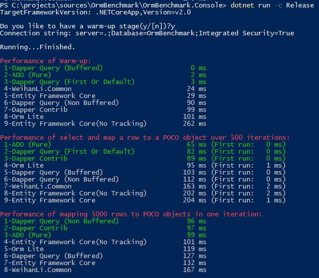

# OrmBenchmark

[English](README.md)

## 简介

这个项目主要是为了测试主要的Orm对于 SqlServer 数据库的查询并将数据转换成所需 POCO 对象的耗时情况（好吧，实际上不完全orm，更像是SqlMapper ...）

测试结果:

框架 | 有预热 | 没有预热
------------ | ------------ | ---------
.NetFramework 4.6 |  | 
.NetCore2.0 |  | 

For details:

- [Net Framework](https://github.com/WeihanLi/OrmBenchmark/tree/netfx)
- [Net Core](https://github.com/WeihanLi/OrmBenchmark/tree/netcore)

## 性能测试

性能测试结果在以下测试中得出：

- 重复执行一个sql命令的性能测试（500次）：
  - 执行一条select语句并将返回的数据映射到POCO对象超过500次迭代

- 将数据库记录映射到POCO对象（5000行）的性能测试：
  - 在一次迭代中将由一个select返回的5000行映射到POCO对象的性能

## 获取测试结果

直接下载这个项目，运行就可以得到结果，并且可以加上你最喜欢的 ORM 框架作为到这个项目中。

## Contact

如果有什么问题欢迎联系我: <weihanli@outlook.com>