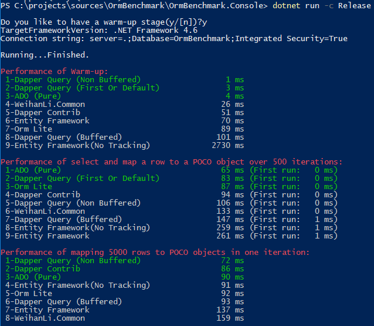
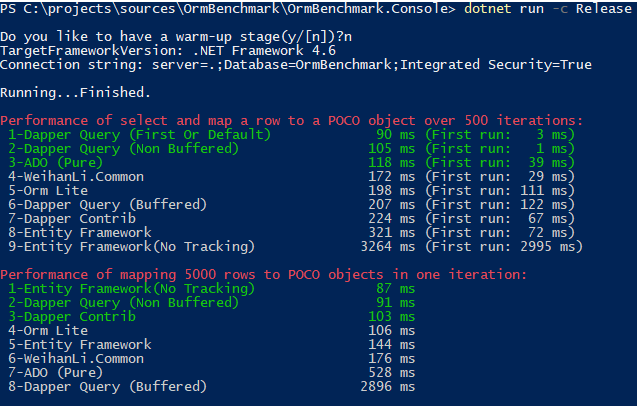

# OrmBenchmark

[Chinese](README.CN.md)

## Intro

The goal of the OrmBenchmark project is to determine how long it takes to execute select statement(s) against a MS SQL Server database and map the returned data to POCOc objects in different ORMs. (Well,acturally not exactly orm,more SqlMapper...)

latest test result:

Framework | With Warmup | Without Warmup
------------ | ------------ | ---------
.NetFramework 4.6 |  | 
.NetCore2.0 |  | 

For details:

- [Net Framework](https://github.com/WeihanLi/OrmBenchmark/tree/netfx)
- [Net Core](https://github.com/WeihanLi/OrmBenchmark/tree/netcore)

## Performance Tests

The performance tests are broken in the following lists:

- Performance test of executing one sql command frequently (500 times):
  - Performance of execute one select statement and map a returned row to a POCO object over 500 iterations

- Performance test of mapping database records to POCO objects (5000 row):
  - Performance of mapping 5000 rows returned by one select to POCO objects in one iteration

## How to run the benchmarks

Just download the project and run it or add your favorite ORM as a plugin to the project.

## Contact

Contact me if you need: <weihanli@outlook.com>